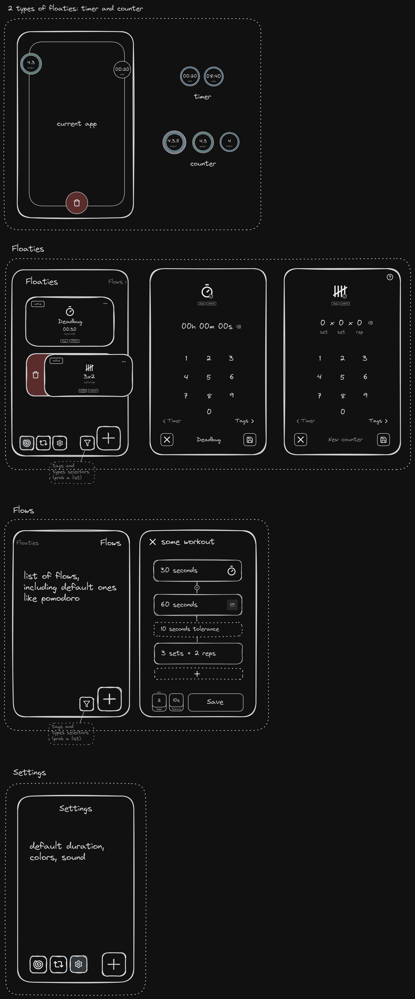

## Nice to haves

- settings screen: default timer, colors, audio
- flows screen: allow users to sort of program loops and sequences for their timers and counters
  - pomodoro flow (predefined): 25 min + 10 sec tolerance + 5 minu break + 10 sec tolerance + 25 min work + 10 sec tolerance + 15 min break, indefinetely.
  - parallel bars flow (predefined): 60 sec work + 10 sec break, 3 times.
- control reps and timers through earbuds
  - toggle UI or long press

